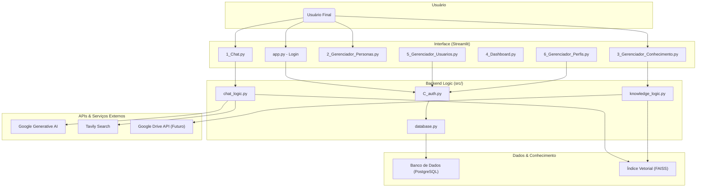

# Arquitetura do Sistema DiamondOne

Este documento descreve a arquitetura de alto nível da plataforma DiamondOne, seus principais componentes e como eles interagem.

---

## Diagrama de Componentes

O diagrama abaixo ilustra a interação entre a interface do usuário, a lógica de backend, a base de dados e as APIs externas.

## Descrição dos Componentes

- **Interface (Streamlit):** É a camada de apresentação com a qual o usuário interage. Cada página é um módulo distinto que lida com uma funcionalidade específica (gerenciar personas, conversar com a IA, etc.).

- **Backend Logic (src/):** Contém a lógica de negócio da aplicação. Separa as responsabilidades, como autenticação, lógica do chat e gerenciamento da base de conhecimento.

- **Dados & Conhecimento:**
    - **PostgreSQL:** Armazena dados estruturados como usuários, perfis, personas, logs de conversas e metadados de documentos.
    - **FAISS:** Um índice vetorial local que armazena os "embeddings" dos documentos para permitir buscas semânticas rápidas (a base do RAG).

- **APIs & Serviços Externos:**
    - **Google Generative AI:** O serviço de LLM que provê a inteligência para gerar respostas.
    - **Tavily Search API:** Utilizada pelas personas do tipo "WEB_ONLY" e "HYBRID" para realizar buscas na internet em tempo real.
    - **Google Drive API:** Planejado para futuras implementações, permitirá a sincronização automática de documentos.
